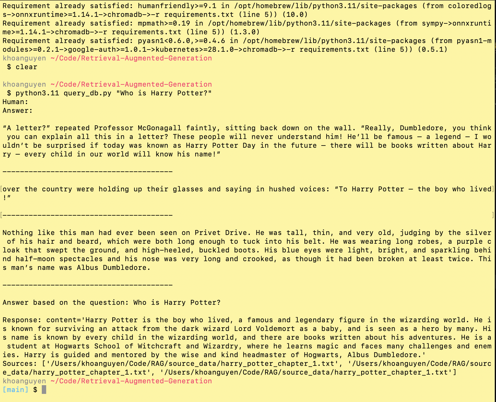
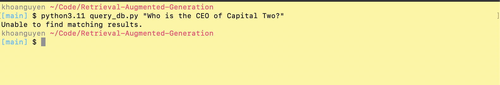

# Retrieval-Augmented Generation

This application demonstrate the uses of Retrieval-Augmented Generation. RAG is an AI framework for retrieving data from an external knowledge base to ground large language models. 

## Technologies
* Python
* Langchain
* OpenAI
* Chroma DB

## Setup Instructions
1. Clone repository to your local machine.
2. CD into project directory from your terminal and run the following command to install dependencies.
```python
pip install -r requirements.txt
```
3. Replace the enivorment placeholder with your OpenAI API key.
```python
os.environ["OPENAI_API_KEY"] = "${PLACE YOUR API KEY HERE}"
```
4. Run the following command to create your Chroma DB.
```python
python src/create_db.py
```
5. Run the following command to query your question to the DB.
```python
python src/query_db.py "Who is Harry Potter?"
```

### Sample Response: 
Valid Question

Invalid Question


## Developer Note:
### Chunking Strategy
Since we're not working with a lot of data, I chose to limit chunks to 700 characters because that's the average length of a paragraph in the text and smaller chunks are better when the data less structured. Chunking in this manner helps to offer the algorithm's generated answers with a more contextual understanding of the question being asked. 
### Tools Used
* Python is a programing language that has a broad library ecosystem, powerful visualization features, strong community support, flexibility, readability, and platform freedom make it an excellent choice for machine learning applications.
* Langchain provides convenient ready-made techniques for the construction of such data-responsive applications, enabling for more efficient and rapid engineering. It also stood out for its seamless interface with OpenAI and Choma DB, which reduced development efforts. 
* OpenAI is an industry-leading AI research and deployment firm that provides extensive developer support and greater flexibility and customisation in certain scenarios.
* Chroma DB is an AI-native open-source vector database that directly integrates with popular LLMs. It provides developers with the ability to quickly compute and store embeddings, as well as find data with similar embeddings in an effective manner.
